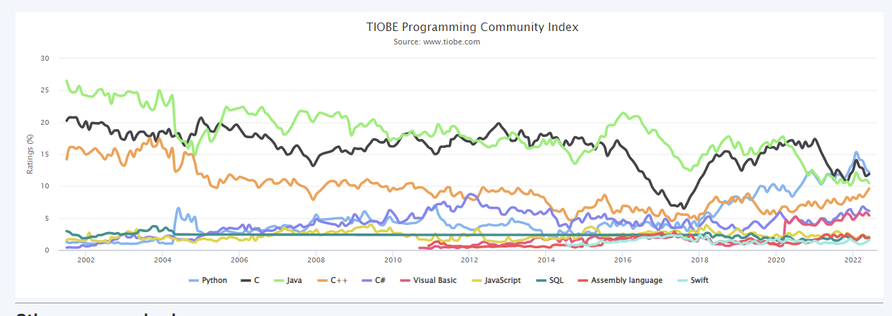
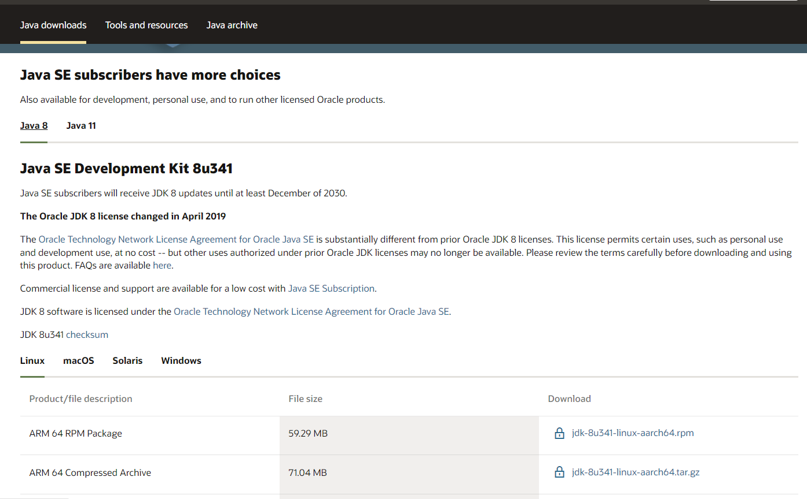
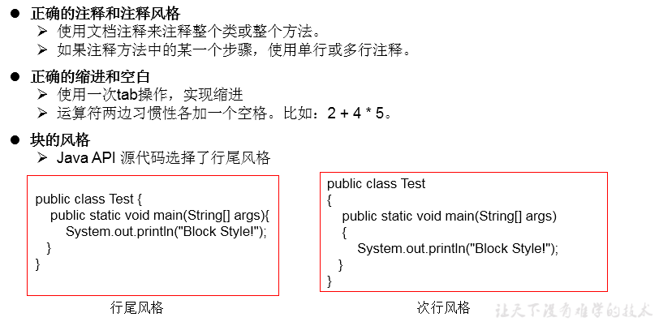
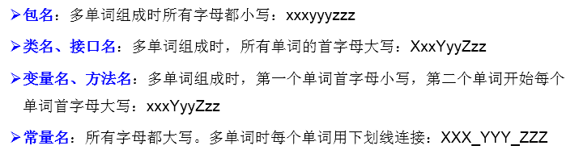
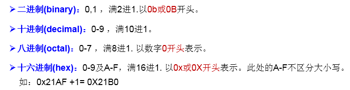
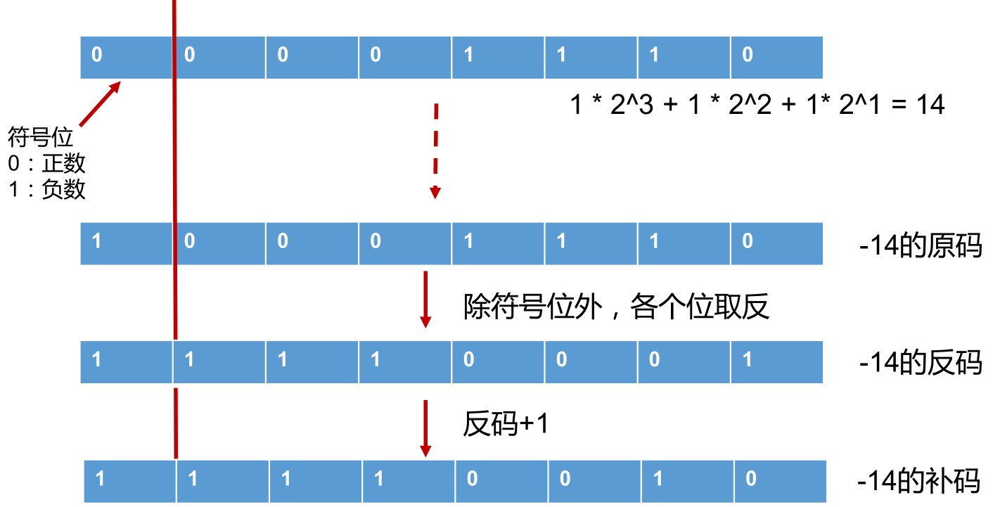

# 	第1章 :Java语言的概述

​                                                                                                                                                                                                                                                                                                                                                                                          摘要                                                                                                        [课程标题]                                                              

## 1.1：课程整体内容概述

- 编程语言核心结构：变量，基本语法，分支循环，数组………
- 面向对象的核心逻辑：OOP，封装，继承，多态，接口。
- JavaSE高级应用程序：异常，集合，IO，多线程，反射机制，网络编程等。
- 实训项目：
  - 项目一：家庭收支记账软件
  - 项目二：客户信息管理软件
  - 项目三：开发团队人员调度软件
  - 附加项目一：银行业务管理软件
  - 附件项目二：单机考试管理软件

## 1.2 ：编程概念

### 1.2.1 ：什么是计算机语言

- **语言**：是人与人之间用于沟通的一种方式。例如：中国人与中国人用普通话沟通。而中国人要和英国人交流，就要学习英语。

- **计算机语言**：人与计算机交流的方式。

  如果人要与计算机交流，那么就要学习计算机语言。

  计算机语言有很多种。如：C ,C++ ,Java ,PHP , Kotlin，Python，Scala等。

### 1.2.2：计算机语言的发展立场

#### 语言格式

**第一代语言**：机器语言。指令以二进制代码形式存在。

**第二代语言**：汇编语言。使用助记符表示一条机器指令。

   

**第三代语言**：高级语言

1. C、Pascal、Fortran面向过程的语言
2. C++面向过程/面向对象
3. Java跨平台的纯面向对象的语言
4. .NET跨语言的平台
5.  Python、Scala…				

#### 基础常识

- **软件**：即一系列按照特定顺序组织的计算机数据和指令的集合。
-  **分类**：系统软件 和 应用软件     
- **系统软件**：windows , mac os , linux ,unix,android,ios,....
-  **应用软件**：word ,ppt,画图板,...
- **人机交互方式**： 图形化界面  vs  命令行方式
- **应用程序** = 算法 + 数据结构

### 1.2.3：语言的市场需求

#### 头条：C++即将超越Java

​	目前Java 似乎处于失败的一方。2020 年 4 月，Java 仍然是 TIOBE 指数的第一名。同月，Java 不得不将第一名让给 C。后来，在 2021 年，Python 势不可挡，也超越了 Java。现在看起来 C++ 是下一个超越 Java 的语言。具有高性能的高级编程是 C++ 表现出色的关键原因。C++ 语言每 3 年修订一次。此类修订包含突破性的新功能，使语言与 C# 和 Java 相提并论，但没有垃圾收集器的性能损失。让我们看看未来几个月 C++ 将走向何方。——保罗·詹森 CEO TIOBE Software

[TIOBE ](https://www.tiobe.com/tiobe-index/)编程社区指数是编程语言流行度的一个指标。该索引每月更新一次。评级基于全球熟练工程师的数量、课程和第三方供应商的数量。Google、Bing、Yahoo!、维基百科、亚马逊、YouTube 和百度等流行搜索引擎用于计算评级。需要注意的是，TIOBE 索引并不是关于最好的编程语言或编写大多数代码行的语言。

| Jun 2022 | Jun 2021 | Change                                       | Programming Language                                         | Ratings              | Change |        |
| -------- | -------- | -------------------------------------------- | ------------------------------------------------------------ | -------------------- | ------ | ------ |
| 1        | 2        |                      |               | Python               | 12.20% | +0.35% |
| 2        | 1        |                    |                         | C                    | 11.91% | -0.64% |
| 3        | 3        |                                              |                                 | Java                 | 10.47% | -1.07% |
| 4        | 4        |                                              |                                   | C++                  | 9.63%  | +2.26% |
| 5        | 5        |                                              |                                     | C#                   | 6.12%  | +1.79% |
| 6        | 6        |                                              |                 | Visual Basic         | 5.42%  | +1.40% |
| 7        | 7        |                                              |       | JavaScript           | 2.09%  | -0.24% |
| 8        | 10       |        |                                   | SQL                  | 1.94%  | +0.06% |
| 9        | 9        |                                              |  | Assembly language    | 1.85%  | -0.21% |
| 10       | 16       |      |                               | Swift                | 1.55%  | +0.44% |
| 11       | 11       |                                              |  | Classic Visual Basic | 1.33%  | -0.40% |
| 12       | 18       |      |  | Delphi/Object Pascal | 1.32%  | +0.26% |
| 13       | 8        |  |  | PHP                  | 1.25%  | -0.97% |
| 14       | 23       |      |                   | Objective-C          | 1.02%  | +0.33% |
| 15       | 20       |      |                                     | Go                   | 1.02%  | +0.07% |
| 16       | 14       |                    |                                       | R                    | 0.98%  | -0.22% |
| 17       | 15       |                    |                                 | Perl                 | 0.76%  | -0.41% |
| 18       | 38       |      |                                   | Lua                  | 0.76%  | +0.43% |
| 19       | 13       |  |                                 | Ruby                 | 0.75%  | -0.48% |
| 20       | 26       |      |                             | Prolog               | 0.74%  | +0.18% |

   

## 1.3 ：Java基础

​	Java语言是SUN(Stanford University Network，斯坦福大学网络公司) 1995年推出的一门高级编程语言。是一种面向Internet的编程语言。Java一开始富有吸引力是因为Java程序可以在Web浏览器中运行。这些Java程序被称为Java小程序（applet）。applet使用现代的图形用户界面与Web用户进行交互。applet内嵌在HTML代码中。

​	随着Java技术在web方面的不断成熟，已经成为Web应用程序的首选开发语言。后台开发：Java、PHP、Python、Go、Node.js

### 1.3.1：常用DOS命令：

   

### 1.3.2：Java简史

​	java之父James Gosling团队在开发”Green”项目时，发现C缺少垃圾回收系统，还有可移植的安全性、分布程序设计和多线程功能。最后，他们想要一种易于移植到各种设备上的平台。

​         Java确实是从C语言和C++语言继承了许多成份，甚至可以将Java看成是`类C语言`发展和衍生的产物。比如Java语言的变量声明，操作符形式，参数传递，流程控制等方面和C语言、C++语言完全相同。但同时，Java是一个**`纯粹的面向对象`**的程序设计语言，它继承了C++语言面向对象技术的核心。Java舍弃了C语言中容易引起错误的指针（以引用取代）、运算符重载（operator overloading）、多重继承（以接口取代）等特性，增加了垃圾回收器功能用于回收不再被引用的对象所占据的内存空间。JDK1.5又引入了泛型编程（GenericProgramming）、类型安全的枚举、不定长参数和自动装/拆箱.

- 1991年Green项目，开发语言最初命名为Oak (橡树)
- 1994年，开发组意识到Oak 非常适合于互联网
- 1996年，发布JDK 1.0，约8.3万个网页应用Java技术来制作
- 1997年，发布JDK 1.1，JavaOne会议召开，创当时全球同类会议规模之最
- 1998年，发布JDK 1.2，同年发布企业平台J2EE
- 1999年，Java分成J2SE、J2EE和J2ME，JSP/Servlet技术诞生
- 2004年，发布里程碑式版本：JDK 1.5，为突出此版本的重要性，更名为JDK 5.0
- 2005年，J2SE -> JavaSE，J2EE -> JavaEE，J2ME -> JavaME
- 2009年，Oracle公司收购SUN，交易价格74亿美元
- 2011年，发布JDK 7.0
- 2014年，发布JDK 8.0，是继JDK 5.0以来变化最大的版本
- 2017年，发布JDK 9.0，最大限度实现模块化
- 2018年3月，发布JDK 10.0，版本号也称为18.3
- 2018年9月，发布JDK 11.0，版本号也称为18.9

### 1.3.3 ：Java语言应用的领域

- Java Web开发：后台开发

- 大数据开发：

- Android应用程序开发：客户端开发


### 1.3.4：Java语言的特点

1. **面向对象性**：两个要素：类、对象。三个特征：封装、继承、多态
2. **健壮性**：① 去除了C语言中的指针 ②自动的垃圾回收机制 -->仍然会出现内存溢出、内存泄漏
3. **跨平台型**：write once,run anywhere:一次编译，到处运行。功劳归功于：JVM

   

`主要特性`	

1.  **Java语言是易学的**。Java语言的语法与C语言和C++语言很接近，使得大多数程序员很容易学习和使用Java。

2. **Java语言是强制面向对象的**。Java语言提供类、接口和继承等原语，为了简单起见，只支持类之间的单继承，但支持接口之间的多继承，并支持类与接口之间的实现机制（关键字为implements）。
3.  **Java语言是分布式的**。Java语言支持Internet应用的开发，在基本的Java应用编程接口中有一个网络应用编程接口（java net），它提供了用于网络应用编程的类库，包括URL、URLConnection、Socket、ServerSocket等。Java的RMI（远程方法激活）机制也是开发分布式应用的重要手段。

4.  **Java语言是健壮的**。Java的强类型机制、异常处理、垃圾的自动收集等是Java程序健壮性的重要保证。对指针的丢弃是Java的明智选择。

5.  **Java语言是安全的**。Java通常被用在网络环境中，为此，Java提供了一个安全机制以防恶意代码的攻击。如：安全防范机制（类ClassLoader），如分配不同的名字空间以防替代本地的同名类、字节代码检查。

6.  **Java语言是体系结构中立的**。Java程序（后缀为java的文件）在Java平台上被编译为体系结构中立的字节码格式（后缀为class的文件），然后可以在实现这个Java平台的任何系统中运行。

7.  **Java语言是解释型的**。如前所述，Java程序在Java平台上被编译为字节码格式，然后可以在实现这个Java平台的任何系统的解释器中运行。

8.  **Java是性能略高的**。与那些解释型的高级脚本语言相比，Java的性能还是较优的。

9.  **Java语言是原生支持多线程的**。在Java语言中，线程是一种特殊的对象，它必须由Thread类或其子（孙）类来创建。


### 1.3.5：Java技术体系平台

| `Java   SE(Java Standard Edition)标准版`                     |
| ------------------------------------------------------------ |
| 支持面向桌面级应用（如Windows下的应用程序）的Java平台，提供了完整的Java核   心API，此版本以前称为J2SE |
| `Java   EE(Java Enterprise Edition)企业版`                   |
| 是为开发企业环境下的应用程序提供的一套解决方案。该技术体系中包含的技术如   :Servlet 、Jsp等，主要针对于Web应用程序开发。版本以前称为J2EE |
| `Java   ME(Java Micro Edition)小型版*`                       |
| 支持Java程序运行在移动终端（手机、PDA）上的平台，对Java API有所精简，并加   入了针对移动终端的支持，此版本以前称为J2ME |
| `Java   Card*`                                               |
| 支持一些Java小程序（Applets）运行在小内存设备（如智能卡）上的平台 |

### 1.3.6：Java在各领域的应用

从Java的应用领域来分，Java语言的应用方向主要表现在以下几个方面：

- **企业级应用**：主要指复杂的大企业的软件系统、各种类型的网站。Java的安全机制以及它的跨平台的优势，使它在分布式系统领域开发中有广泛应用。应用领域包括金融、电信、交通、电子商务等。
- **Android****平台应用**：Android应用程序使用Java语言编写。Android开发水平的高低很大程度上取决于Java语言核心能力是否扎实。
- **大数据平台开发**：各类框架有Hadoop，spark，storm，flink等，就这类技术生态圈来讲，还有各种中间件如flume，kafka，sqoop等等，这些框架以及工具大多数是用Java编写而成，但提供诸如Java，scala，Python，R等各种语言API供编程。
- **移动领域应用**：主要表现在消费和嵌入式领域，是指在各种小型设备上的应用，包括手机、PDA、机顶盒、汽车通信设备等。


# 第2章：开发环境的搭建

`Java两种核心机制`：

1. Java虚拟机(Java Virtal Machine)
2. 垃圾收集机制(Garbage Collection)

## 2.1:核心机制—Java虚拟机

JVM是一个虚拟的计算机，具有指令集并使用不同的存储区域。负责执行指令，管理数据、内存、寄存器。

- 对于不同的平台，有不同的虚拟机。

- 只有某平台提供了对应的java虚拟机，java程序才可在此平台运行

- Java虚拟机机制屏蔽了底层运行平台的差别，实现了“一次编译，到处运行”


## 2.2:核心机制—垃圾回收

- 不再使用的内存空间应回收—— 垃圾回收。

  1. 在C/C++等语言中，由程序员负责回收无用内存。
  2. Java 语言消除了程序员回收无用内存空间的责任：它提供一种系统级线程跟踪存储空间的分配情况。并在JVM空闲时，检查并释放那些可被释放的存储空间。
- 垃圾回收在Java程序运行过程中自动进行，程序员无法精确控制和干预。


- Java程序还会出现内存泄漏和内存溢出问题吗？Yes!


## 2.3:JDK、JRE、JVM的关系

**JDK、JRE、JVM的关系**


## 2.4:JDK的下载、安装

**`下载`**：官网，github

**`安装`**：傻瓜式安装：JDK 、JRE

**`注意问题`**：安装软件的路径中不能包含中文、空格。

## 2.5:path环境变量的配置

### 2.5.1 :为何配置path环境变量？

path环境变量：windows操作系统执行命令时所要搜寻的路径

为什么要配置path:希望java的开发工具（javac.exe,java.exe)在任何的文件路径下都可以执行成功。

### 2.5.2:如何配置？

每次执行 java 的工具都要进入到bin目录下，是非常麻烦的。可不可以在任何目录下都可以执行java的工具呢？

- 根据windows系统在查找可执行程序的原理，可以将java工具所在路径定义到path 环境变量中，让系统帮我们去找运行执行的程序。
- 配置方法
  - 我的电脑--属性--高级系统设置--环境变量
  - 编辑 path 环境变量，在变量值开始处加上java工具所在目录，后面用 “ ; ”和其他值分隔开即可。
  - 打开DOS命令行，任意目录下敲入javac。如果出现javac 的参数信息，配置成功。


### 2.5.3：验证


## 2.6：JDK 8 的安装与配置

### 2.6.1：安装环节

- [打开网页](https://www.oracle.com/)


下载对应平台的合适的 JDK 版本。



- 双击下载的 exe,如 jdk-8u131-windows-x64.exe。
- 进入安装向导。


- 下一步,更改安装路径，选择安装所有组件


更改为 D:\developer_tools\Java\jdk1.8.0_131\


点击确定


-  下一步，开始安装


- 安装 jre，可以更改 jre 安装路径。(过程同上述安装目录的选择)

  注意：如果提示需要将 jre 安装在一个空目录下，那自己创建一个目录即可。

  

  点击下一步，开始安装

  

  

- 结束安装


### 2.6.2：配置环节

- 选中桌面”我的电脑”-右键选择属性，选择高级系统设置。


- 点击环境变量


- 新建一项系统变量“JAVA_HOME”,值为 jdk 的安装路径


- 配置系统变量:双击系统变量的 path，在变量值最前端添加%JAVA_HOME%\bin; 然后确定-确定


- 检验是否配置成功：通过运行-cmd 指令，进入命令行窗口。输入：javac.exe


- 检验 java.exe 命令


- 获取当前安装的 jdk 的版本信息


### 2.6.3：下载 API

同时学习 java 少不了 API （Application Programming Interface）文档。

下载地址：http://www.oracle.com/technetwork/java/javase/downloads/index.html

将页面上的滚动条向下滚动，找到”Additional Resources”部分。如下：


或者通过主页面，找到链接地址进来：


# 第3章：开发体验— HelloWorld   

## 3.1：第一个开发程序

步骤：
1. 将 Java 代码 编写到扩展名为 .java 的文件中。
2. 通过 javac 命令对该 java 文件进行 编译。
3. 通过 java 命令对生成的 class 文件进行 运行


### 步骤一：编写

- 选择最简单的编辑器：记事本。
- 敲入代码

```
 class Test{ }
```

​	将文件保存成Test.java，这个文件是存放java代码的文件，称为源文件。

- 第一个Java程序

```Java
public class Test{
public static void main(String[] args) {
System.out.println(“Hello World!”);
	}
}
```

### 步骤二：编译


1. 有了java源文件，通过编译器将其编译成JVM可以识别的字节码文件。
2. 在该源文件目录下，通过javac编译工具对Test.java文件进行编译。
3. 如果程序没有错误，没有任何提示，但在当前目录下会出现一个Test.class文件，该文件称为字节码文件，也是可以执行的java的程序。

### 步骤三：运行

1. 有了可执行的java程序(Test.class字节码文件)

2. 通过运行工具java.exe对字节码文件进行执行。

3. 出现提示：缺少一个名称为main的方法。

   

-  因为一个程序的执行需要一个起始点或者入口，所以在Test类中的加入

- ```Java
  public static void main(String[] args){ }
  ```

- 对修改后的Test.java源文件需要重新编译，生成新的class文件后，再进行执行。

- 发现没有编译失败，但也没有任何效果，因为并没有告诉JVM要帮我们做什么事情，也就是
  没有可以具体执行的语句。

- 想要和JVM来个互动，只要在main方法中加入一句

  ```java
  System.out.println(“Hello World");
  ```

  因为程序进行改动，所以再重新编译，运行即可。

## 3.2：常见问题及解决方法


## 3.3：总结第一个程序

学习编程最容易犯的错是语法错误。Java要求你必须按照语法规则编写代码。如果你的程序违反了语法规则，例如：忘记了分号、大括号、引号，或者拼错了单词，java编译器都会报语法错误。**尝试着去看懂编译器会报告的错误信息。**

1. java程序编写-编译-运行的过程
  编写：我们将编写的java代码保存在以".java"结尾的源文件中
  编译：使用javac.exe命令编译我们的java源文件。格式：javac 源文件名.java
  运行：使用java.exe命令解释运行我们的字节码文件。 格式：java 类名
2. 在一个java源文件中可以声明多个class。但是，只能最多有一个类声明为public的。
  而且要求声明为public的类的类名必须与源文件名相同。
3. 程序的入口是main()方法。格式是固定的。
4. 输出语句：
  System.out.println():先输出数据，然后换行
  System.out.print():只输出数据
5. 每一行执行语句都以";"结束。
6. 编译的过程：编译以后，会生成一个或多个字节码文件。字节码文件的文件名与java源文件中的类名相同。

## 3.4：注释:Comment

### 注释类型

-  用于注解说明解释程序的文字就是注释。
- Java中的注释类型：
  1. 单行注释   	//
  2. 多行注释         /*    */
  3. 文档注释 (java特有)    /**    */
- 提高了代码的阅读性；调试程序的重要方法。
- 注释是一个程序员必须要具有的良好编程习惯。
- 将自己的思想通过注释先整理出来，再用代码去体现

###  注释作用

① 对所写的程序进行解释说明，增强可读性。方便自己，方便别人
② 调试所写的代码
特点：
①单行注释和多行注释，注释了的内容不参与编译。
  换句话说，编译以后生成的.class结尾的字节码文件中不包含注释掉的信息
② 注释内容可以被JDK提供的工具 javadoc 所解析，生成一套以网页文件形式体现的该程序的说明文档。

### 文档注释

- 文档 注释（ （Java 特有）
  格式：

```
/**
@author 指定java 程序的作者
@version 指定源文件的版本
*/
```

- 注释内容可以被JDK提供的工具 javadoc 所解析，生成一套以网页文件形式体现的该程序的说明文档
- 操作方式

 


### 小结 第一个程序

1. Java源文件以“java”为扩展名。源文件的基本组成部分是类（class），如本例中的HelloWorld类。

2. Java应用程序的执行入口是main()方法。它有固定的书写格式：

   ```
   public static void main(String[] args) {...}
   ```

   Java语言严格区分大小写。

3. Java方法由一条条语句构成，每个语句以“;”结束。

4. 大括号都是成对出现的，缺一不可。

5. 一个源文件中最多只能有一个public类。其它类的个数不限，如果源文件包含一个public类，则文件名必须按该类名命名。

## 3.5：Java API文档

1. API （Application Programming Interface,应用程序编程接口）是 Java 提供的基本编程接口。
2. Java语言提供了大量的基础类，因此 Oracle 也为这些基础类提供了相应的API文档，用于告诉开发者如何使用这些类，以及这些类里包含的方法。
3. 下载API：Additional Resources-Java SE 8 Documentation下载。
   http://www.oracle.com/technetwork/java/javase/downloads/index.html
4. 详见： ：JDK8的 的载 下载- 安装- 配置.doc


## 3.6：良好的编程风格



## 3.7：常用的Java开发工具

- 文本编辑工具：
  1. 记事本
  2. UltraEdit
  3. EditPlus
  4. TextPad
  5.  NotePad

- Java集成开发环境（IDE)：
  1. JBuilder
  2.  NetBeans
  3.  Eclipse
  4. MyEclipse
  5. IntelliJ IDEA

## 3.8：常用的Java开发工具

### JBuilder

[JBuilder](https://edn.embarcadero.com/cn/jbuilder)是Borland公司开发的针对java的开发工具，使用JBuilder将可以快速，有效的开发各类java应用。 Jbuilder支持各种应用服务器。Jbuilder与Inprise Application Server紧密集成，同时支持WebLogicServer，支持EJB 1.1和EJB 2.0，可以快速开发J2EE的电子商务应用。支持远程调试和多线程调试，调试器支持各种JDK版本

### NetBeans

[NetBeans](https://netbeans.org/features/index.html)是一款用Java编写的开源IDE。既可用于Java开发，也支持其他语言，特别是PHP、C/C ++，和HTML5。NetBeans开发环境提供了丰富的产品文档和培训资源以及大量的第三方插件。

### Eclipse

[Eclipse](https://www.eclipse.org/)应该是大多数Java程序员使用的第一个IDE。众所周知的、最流行、也最受欢迎的Java开发工具。优
点很多：免费、更新快、代码智能化、ANT构建等，拥有众多插件，完全免费、有中文版、上手比较快。缺点也非常明显，安装插件麻烦、插件对版本要求比较严格。

### MyEclipse

[MyEclipse](https://www.myeclipsecn.com/)也是一款功能强大的J2EE集成开发环境，由Genuitec公司发布，提供免费版和收费版。但免费版，只能满足基本开发需求

### IntelliJ IDEA

[IntelliJ IDEA](https://www.jetbrains.com/idea/)被认为是目前Java开发效率最快的IDE工具。是JetBrains公司的产品，这家公司总部位于捷克共和国的首都布拉格。它整合了开发过程中实用的众多功能，智能提示错误，强大的调试工具，Ant，JavaEE支持，CVS整合，最大程度的加快开发的速度。简单而又功能强大。与其他的一些繁冗而复杂的IDE工具有鲜明的对比。


# 第4章：基本语法

## 4.1：关键字与保留字

### 关键字

- 关键字(keyword)的 的 定义和特点

  - 定义：被 被Java 语言赋予了特殊含义，用做专门用途的字符串（单词）
  - 特点： 关键字中所有字母都为 小写
  - 官方地址： https://docs.oracle.com/javase/tutorial/java/nutsandbolts/_keywords.html

  

  

### 保留字

Java保留字：现有Java版本尚未使用，但以后版本可能会作为关键字使用。自己命名标识符时要避免使用这些保留字goto 、const


## 4.2：标识符

- Java 对各种 变量、 方法和 类等要素命名时使用的字符序列称为标识符
- 技巧：凡是自己可以起名字的地方都叫标识符。
- 涉及到的结构：包名、类名、接口名、变量名、方法名、常量名

**定义合法标识符规则**：


Java中的名称命名规范：



**注意1**：在起名字时，为了提高阅读性，要尽量有意义，“见名知意”。
**注意2**：java采用unicode字符集，因此标识符也可以使用汉字声明，但是不建议使用。

## 4.3：变量

- 变量的概念：

  - 内存中的一个存储区域
  - 该区域的数据可以在同一类型范围内不断变化
  - 变量是程序中最基本的存储单元。包含**变量类型、变量名和存储的值**

-  变量的作用：用于在内存中保存数据

-  使用变量注意：

  - Java中每个变量必须先声明，后使用

  - 使用变量名来访问这块区域的数据

  - 变量的作用域：其定义所在的一对{ }内

  - 变量只有在其作用域内才有效

  - 同一个作用域内，不能定义重名的变量

    

- 声明变量
  -  语法：<数据类型> <变量名称>		例如：int var;
-  变量的赋值
  - 语法：<变量名称> = <值>		例如：var = 10;
-   声明和赋值变量
  - 语法： <数据类型> <变量名> = <初始化值> 		 例如：int var = 10;

## 4.4：按数据类型分类


**详细说明：**

1. 整型：byte(1字节=8bit) \ short(2字节) \ int(4字节) \ long(8字节)
   		//① byte范围：-128 ~ 127
   		// ② 声明long型变量，必须以"l"或"L"结尾
   		// ③ 通常，定义整型变量时，使用int型。
         		 //④整型的常量，默认类型是：int型
2. 浮点型：float(4字节) \ double(8字节)
   	//① 浮点型，表示带小数点的数值
   	//② float表示数值的范围比long还大
   	//③ 定义float类型变量时，变量要以"f"或"F"结尾
   	//④ 通常，定义浮点型变量时，使用double型。
   	//⑤ 浮点型的常量，默认类型为：double
3. 字符型：char (1字符=2字节)
   	//① 定义char型变量，通常使用一对'',内部只能写一个字符
   	//② 表示方式：1.声明一个字符 2.转义字符 3.直接使用 Unicode 值来表示字符型常量
4. 布尔型：boolean
   	//① 只能取两个值之一：true 、 false
   	//② 常常在条件判断、循环结构中使用

补充：变量的分类-按声明的位置的不同

- 在方法体外，类体内声明的变量称为 成员变量 。
- 在方法体内部声明的变量称为 局部变量 。


● 注意：二者在初始化值方面的异同:
同：都有生命周期 异：局部变量除形参外，需显式初始化。

### 整数类型

整数类型：byte 、short 、int 、long

- Java各整数类型有固定的表数范围和字段长度，不受具体OS的影响，以保证java程序的可移植性。
- java的整型常量默认为 int 型，声明long型常量须后加‘l’或‘L’
- java程序中变量通常声明为int型，除非不足以表示较大的数，才使用long


**定义变量的格式：**
**数据类型**  变量名 = 变量值;		或		数据类型  变量名;		变量名 = 变量值;

### 浮点类型

浮点类型：float 、double

- 与整数类型类似，Java 浮点类型也有固定的表数范围和字段长度，不受具体操作系统的影响。
- 浮点型常量有两种表示形式：
- 十进制数形式：如：5.12 512.0f .512 (必须有小数点）
- 科学计数法形式:如：5.12e2 512E2 100E-2
- float:单精度，尾数可以精确到7位有效数字。很多情况下，精度很难满足需求。double:双精度，精度是float的两倍。通常采用此类型。
- Java  的浮点型常量默认为double型 型，明 声明float 型常量，须后加‘f’ 或‘F’


### 字符类型

字符类型：char

1. char 型数据用来表示通常意义上“字符”(2字节)
2. Java中的所有字符都使用Unicode编码，故一个字符可以存储一个字母，一个汉字，或其他书面语的一个字符。
3. 字符型变量的三种表现形式：
   1. 字符常量是用单引号(‘ ’)括起来的单个字符。例如：char c1 = 'a'; char c2= '中'; char c3 = '9';
   2. Java中还允许使用转义字符‘\’来将其后的字符转变为特殊字符型常量。
      例如：char c3 = ‘\n’; // '\n'表示换行符
   3. 直接使用 Unicode 值来表示字符型常量：‘\uXXXX’。其中，XXXX代表一个十六进制整数。如：\u000a 表示 \n。
4. char类型是可以进行运算的。因为它都对应有Unicode码。

### 布尔类型：boolean

布尔类型：boolean

- boolean 类型用来判断逻辑条件，一般用于程序流程控制：
  - if条件控制语句；
  - while循环控制语句；
  - do-while循环控制语句；
  - for循环控制语句、、
- boolean类型数据只允许取值true和false，无null。
  - 不可以使用0或非 0 的整数替代false和true，这点和C语言不同。
  - Java虚拟机中没有任何供boolean值专用的字节码指令，Java语言表达所操作的boolean值，在编译之后都使用java虚拟机中的int数据类型来代替：true用1表示，false用0表示。———《java虚拟机规范 8版》

### **字符串类型**

字符串类型：String

- String不是基本数据类型，属于引用数据类型

- 使用方式与基本数据类型一致。例如：String str = “abcd”;

-  一个字符串可以串接另一个字符串，也可以直接串接其他类型的数据。例如：

  ```
  str = str + “xyz” ;
  int n = 100;
  str = str + n;
  ```

变量使用的注意点：
   ① 变量必须先声明，后使用
   ② 变量都定义在其作用域内。在作用域内，它是有效的。换句话说，出了作用域，就失效了
   ③ 同一个作用域内，不可以声明两个同名的变量

## 4.5：编码

### 4.5.1：了解：ASCII 码

- 在计算机内部，所有数据都使用 二进制表示。每一个二进制位（bit）有 0 和 1 两种状态，因此 8 个二进制位就可以组合出 256  种状态，这被称为一个字节（byte）。一个字节一共可以用来表示 256 种不同的状态，每一个状态对应一个符号，就是 256 个符号，从0000000 到 11111111。
- ASCII码：上个世纪60年代，美国制定了一套字符编码，对英语字符与二进制位之间的关系，做了统一规定。这被称为ASCII码。ASCII码一共规定了128个 个字符的编码，比如空格“SPACE”是32（二进制00100000），大写的字母A是65（二进制01000001）。这128个符号（包括32个不能打印出来的控制符号），只占用了一个字节的后面7位，最前面的1位统一规定为0。
- 缺点 ：
  不能表示所有字符。
  相同的编码表示的字符不一样：比如，130在法语编码中代表了é，在希伯来语编码中却代表了字母Gimel ()ג

### 4.5.2：了解： Unicode  编码

**乱码**：世界上存在着多种编码方式，同一个二进制数字可以被解释成不同的符号。因此，要想打开一个文本文件，就必须知道它的编码方式，否则用错误的编码方式解读，就会出现乱码。
**Unicode**： 一种编码，将世界上所有的符号都纳入其中。每一个符号都给予一个独一用 无二的编码，使用 Unicode  没有乱码的问题 。
**Unicode 的缺点**：Unicode 只规定了符号的二进制代码，却没有规定这个二进制代码应该如何存储：无法区别 Unicode 和 ASCII：计算机无法区分三个字节表示一个符号还是分别表示三个符号。另外，我们知道，英文字母只用一个字节表示就够了，如果unicode统一规定，每个符号用三个或四个字节表示，那么每个英文字母前都必然有二到三个字节是0，这对于存储空间来说是极大的浪费。

### 4.5.3：了解： UTF-8

- UTF-8 是在互联网上使用最广的一种 Unicode 的实现方式。
- UTF-8 是一种变长的编码方式。它可以使用 1-6 个字节表示一个符号，根据不同的符号而变化字节长度。
- UTF-8的编码规则：
  - 对于单字节的UTF-8编码，该字节的最高位为0，其余7位用来对字符进行编码（等同于ASCII码）。
  - 对于多字节的UTF-8编码，如果编码包含 n 个字节，那么第一个字节的前 n 位为1，第一个字节的第 n+1 位为0，该字节的剩余各位用来对字符进行编码。在第一个字节之后的所有的字节，都是最高两位为"10"，其余6位用来对字符进行编码。

## 4.6：基本数据类型转换

**自动类型转换**：容量小的类型自动转换为容量大的数据类型。数据类型按容量大小排序为：

```
byte 、char 、short --> int --> long --> float --> double 
```

特别的：当byte、char、short三种类型的变量做运算时，结果为int型
说明：此时的容量大小指的是，表示数的范围的大和小。比如：float容量要大于long的容量

- 有多种类型的数据混合运算时，系统首先自动将所有数据转换成容量最大的那种数据类型，然后再进行计算
- byte,short,char之间不会相互转换，他们三者在计算时首先转换为int类型。
- boolean类型不能与其它数据类型运算。
- 当把任何基本数据类型的值和字符串(String)进行连接运算时(+)，基本数据类型的值将自动转化为字符串(String)类型。

## 4.7：强制类型转换

- 自动类型转换的逆过程，将容量大的数据类型转换为容量小的数据类型。使用时要加上强制转换符：()，但可能造成**精度降低或溢出**,格外要注意。
- 通常，字符串不能直接转换为基本类型，但通过基本类型对应的包装类则可以实现把字符串转换成基本类型。
- 如： String a = “43”; int i = Integer.parseInt(a);
- boolean类型不可以转换为其它的数据类型。


## 4.8：进制及表示方式

### 1.进制的概念



|        |          |        |        |
| ------ | -------- | ------ | ------ |
| 十进制 | 十六进制 | 八进制 | 二进制 |
| 0      | 0        | 0      | 0      |
| 1      | 1        | 1      | 1      |
| 2      | 2        | 2      | 10     |
| 3      | 3        | 3      | 11     |
| 4      | 4        | 4      | 100    |
| 5      | 5        | 5      | 101    |
| 6      | 6        | 6      | 110    |
| 7      | 7        | 7      | 111    |
| 8      | 8        | 10     | 1000   |
| 9      | 9        | 11     | 1001   |
| 10     | A        | 12     | 1010   |
| 11     |          | 13     | 1011   |
| 12     |          | 14     | 1100   |
| 13     |          | 15     | 1101   |
| 14     |          | 16     | 1110   |
| 15     |          | 17     | 1111   |
| 16     | 10       | 20     | 10000  |
| 17     | 11       | 21     | 10001  |


### 2.二进制

- Java整数常量默认是int类型，当用二进制定义整数时，其第32位是符号位；当是long类型时，二进制默认占64位，第64位是符号位
- 二进制的整数有如下三种形式：
  - 原码：直接将一个数值换成二进制数。最高位是符号位
  - 负数的反码：是对原码按位取反，只是最高位（符号位）确定为1。
  - 负数的补码是其反码+1
- 计算机以二进制补码的形式保存所有的整数。
  - 正数的原码、反码、补码都相同
  - 负数的补码是其反码+1

为什么要使用原码、反码、补码表示形式呢？

计算机辨别“符号位”显然会让计算机的基础电路设计变得十分复杂! 于是人们想出了将符号位也参与运算的方法. 我们知道, 根据运算法则减去一个正数等于加上一个负数, 即: 1-1 = 1 + (-1) = 0 , 所以机器可以只有加法而没有减法, 这样计算机运算的设计就更简单了。


### 3.进制间的转换


#### 二进制->十进制




#### 4.二进制与八进制、十六进制间的转换：


 	 

5.反码，补码，源码


# 第5章：运算符

运算符是一种特殊的符号，用以表示数据的运算、赋值和比较等。

- 算术运算符
- 赋值运算符
- 比较运算符（关系运算符）
- 逻辑运算符
- 位运算符
- 三元运算符

## 运算符：算术运算符


# 知识点回顾

## 知识点一

● JDK,JRE,JVM的关系。
● 环境变量path配置及其作用。
● Java程序的编写、编译、运行步骤：


● Java程序编写的规则。
● 在配置环境、编译、运行各个步骤中常见的错误以及解决方法。


