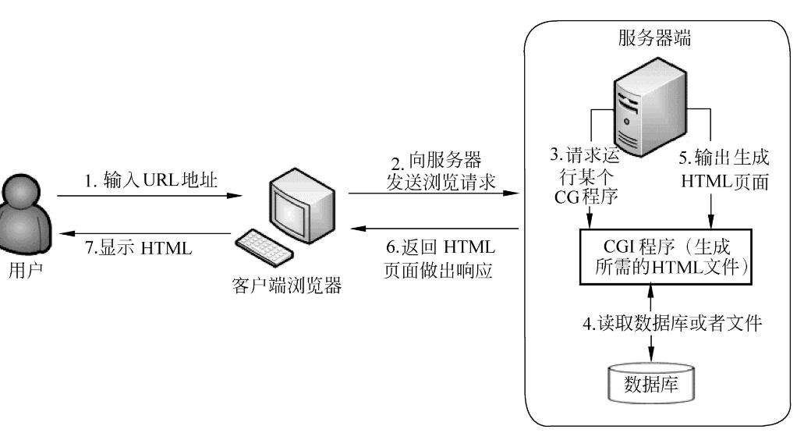
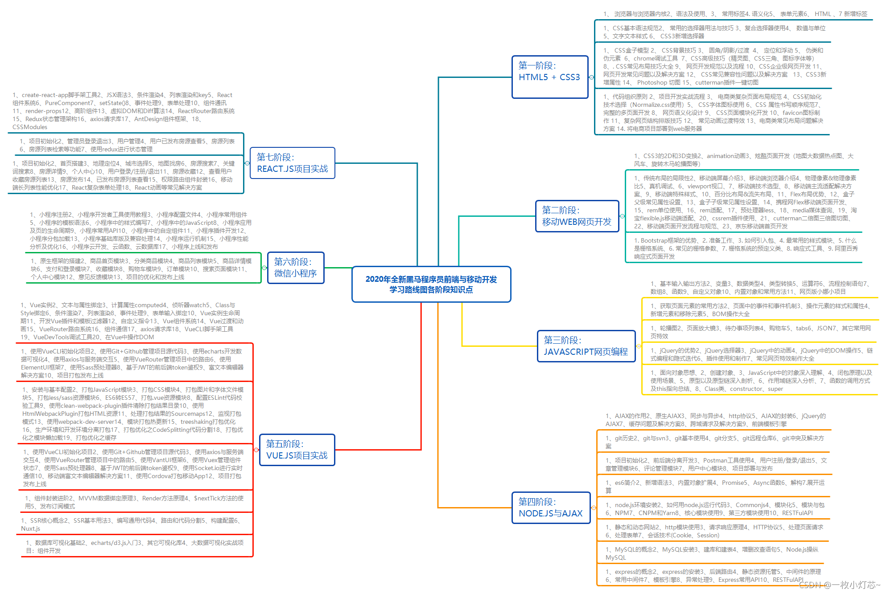
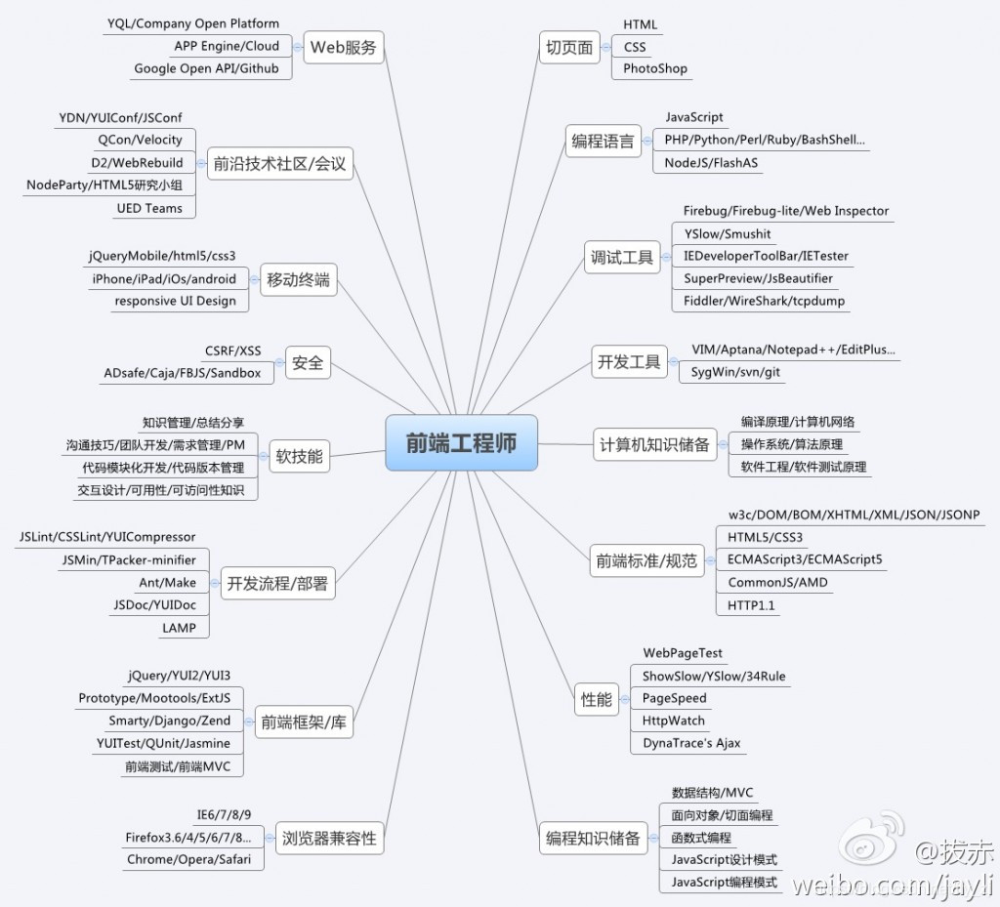

# Html教程

## Web的工作原理

1. 用户在浏览器中输入要访问的web站点地址或在已打开的站点点击超链接。

2. 由dns进行域名解析，找到服务器的IP地址，向该地址指向的web服务器发出请求。

3. web服务器根据请求将URL地址转换为页面所在的服务器上的文件全名，查找相应的文件。

4. 若URL指向静态文件，则服务器将文件通过http协议传输给用户浏览器；若HTML文档中嵌入了ASP,PHP,JSP等程序，则由服务器直接运行后返回给用户；

   ​	如果web服务器所运行程序包含对数据库的访问，服务器会将查询指令发送给数据库服务器，对数据库执行查询操作，查询结果由数据库返回给web服务器，再由web服务器将结果潜入页面，并以html格式发送给浏览器。

5. 浏览器解释html文档，在客户端屏幕上展示结果。

## WEB的相关技术

​	

​	

​	

